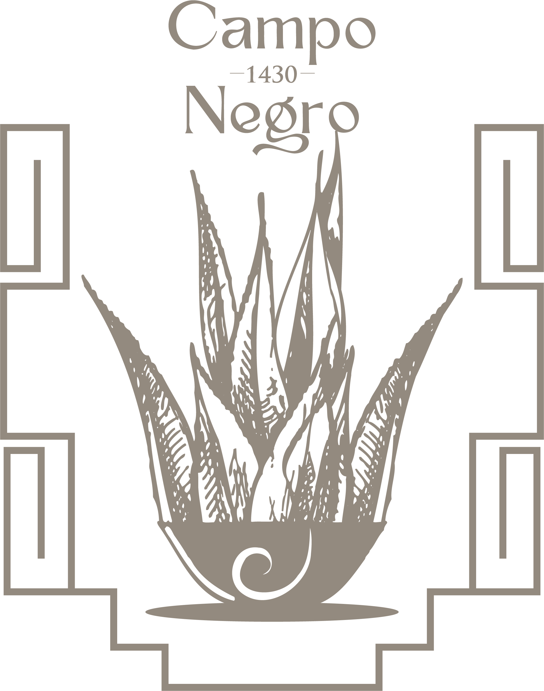

<div align="center">



# Campo Negro 1430

### Landing page oficial · Mezcal artesanal de Oaxaca

Una experiencia web desarrollada para transmitir la identidad, historia y tradición de **Campo Negro 1430**, combinando una estética editorial con una arquitectura limpia, modular y escalable.

<br />

[](https://nextjs.org/)
[](https://react.dev/)
[](https://www.typescriptlang.org/)
[](https://tailwindcss.com/)
[](#estado-del-proyecto)

</div>

---

## ✦ Sobre el proyecto

**Campo Negro 1430** es una landing page enfocada en presentar la esencia de una marca de mezcal artesanal originaria de Oaxaca.

El proyecto fue reconstruido desde cero tomando como referencia una propuesta visual previa, priorizando:

- una estructura clara y mantenible;
- componentes separados por responsabilidad;
- navegación interna para una experiencia tipo *one page*;
- diseño adaptable a diferentes tamaños de pantalla;
- recursos visuales organizados localmente;
- buenas prácticas con Git y control de versiones;
- una base preparada para futuras ampliaciones.

---

## ✦ Secciones

| Sección | Descripción |
|---|---|
| **Inicio** | Portada principal con identidad visual y navegación. |
| **Nuestra Esencia** | Filosofía, raíces y valores de Campo Negro. |
| **Nuestra Historia** | Historia de la marca y vínculo con Ejutla de Crespo. |
| **Nuestro Mezcal** | Presentación del Espadín Joven y sus características. |
| **Proceso** | Etapas principales del proceso artesanal. |
| **Contacto** | Redes sociales, identidad de marca y cierre del sitio. |

---

## ✦ Tecnologías

```text
Next.js
React
TypeScript
Tailwind CSS
CSS Modules
next/font
next/image
Git
GitHub
```

---

## ✦ Estructura del proyecto

```text
campo-negro-web/
│
├── public/
│   └── imagenes/
│       ├── esencia/
│       ├── historia/
│       ├── iconos/
│       ├── marca/
│       ├── mezcal/
│       ├── pie-pagina/
│       ├── portada/
│       └── proceso/
│
├── src/
│   ├── app/
│   │   ├── globals.css
│   │   ├── layout.tsx
│   │   └── page.tsx
│   │
│   ├── componentes/
│   │   ├── estructura/
│   │   │   ├── encabezado/
│   │   │   └── pie-pagina/
│   │   ├── secciones/
│   │   │   ├── esencia/
│   │   │   ├── historia/
│   │   │   ├── mezcal/
│   │   │   ├── portada/
│   │   │   └── proceso/
│   │   └── interfaz/
│   │
│   ├── configuracion/
│   ├── datos/
│   ├── tipos/
│   └── utilidades/
│
├── package.json
├── tsconfig.json
└── README.md
```

---

## ✦ Instalación

```bash
git clone https://github.com/eduard165/campo-negro-web.git
cd campo-negro-web
npm install
npm run dev
```

Después abre:

```text
http://localhost:3000
```

---

## ✦ Scripts disponibles

| Comando | Función |
|---|---|
| `npm run dev` | Inicia el entorno de desarrollo. |
| `npm run build` | Genera la versión de producción. |
| `npm run start` | Ejecuta la aplicación compilada. |
| `npm run lint` | Analiza el código con ESLint. |

---

## ✦ Navegación

El sitio funciona como una **landing page de una sola página**.

```text
#inicio
#historia
#mezcal
#proceso
#contacto
```

La configuración del menú se encuentra en:

```text
src/datos/navegacion.ts
```

---

## ✦ Identidad visual

La interfaz toma como base los lineamientos gráficos de Campo Negro 1430, manteniendo una estética sobria, artesanal y editorial.

### Tipografías

| Tipografía | Uso |
|---|---|
| **Gill Sans MT Condensed** | Titulares y encabezados principales. |
| **Myriad Pro** | Bloques de texto, párrafos y contenido informativo. |
| **Luxurious Script Regular** | Frases destacadas, palabras de acento y textos breves. |

La combinación tipográfica busca mantener contraste entre titulares de carácter editorial, bloques de lectura limpios y acentos caligráficos de uso puntual.

### Paleta de color

| Color | Hex | RGB | Uso sugerido |
|---|---|---|---|
| **Tierra Oaxaqueña** | `#938a7f` | `147, 138, 127` | Tonos secundarios, iconografía y detalles suaves. |
| **Cal** | `#f4f1e8` | `244, 241, 232` | Fondos claros y áreas de descanso visual. |
| **Oro de Maguey** | `#c69c45` | `198, 156, 69` | Acentos, líneas decorativas y elementos destacados. |
| **Brasa** | `#79170e` | `121, 23, 14` | Acentos cálidos y elementos de identidad. |
| **Ceniza** | `#2e2d2c` | `46, 45, 44` | Texto oscuro, fondos profundos y contraste. |

```css
:root {
  --color-tierra-oaxaquena: #938a7f;
  --color-cal: #f4f1e8;
  --color-oro-maguey: #c69c45;
  --color-brasa: #79170e;
  --color-ceniza: #2e2d2c;
}
```

---

## ✦ Sistema visual

El diseño combina:

- tonos crema y tierra;
- marrones profundos;
- blanco y negro;
- acentos dorados;
- tipografía condensada para titulares;
- tipografía sans serif para lectura;
- caligrafía para frases cortas y momentos de énfasis.

Los recursos oficiales de marca se almacenan dentro de:

```text
public/imagenes/
```

## ✦ Repositorio

<div align="center">

### [github.com/eduard165/campo-negro-web](https://github.com/eduard165/campo-negro-web)

</div>

---

## ✦ Créditos

**Desarrollo web**  
Eduardo Rodríguez

**Identidad visual y material gráfico**  
Campo Negro 1430

**Diseño / colaboración visual**  
Iván Betancourt

---

<div align="center">

### Campo Negro 1430

**Tradición · Tierra · Mezcal · Oaxaca**

<sub>Hecho con atención al detalle y respeto por la identidad de la marca.</sub>

</div>
